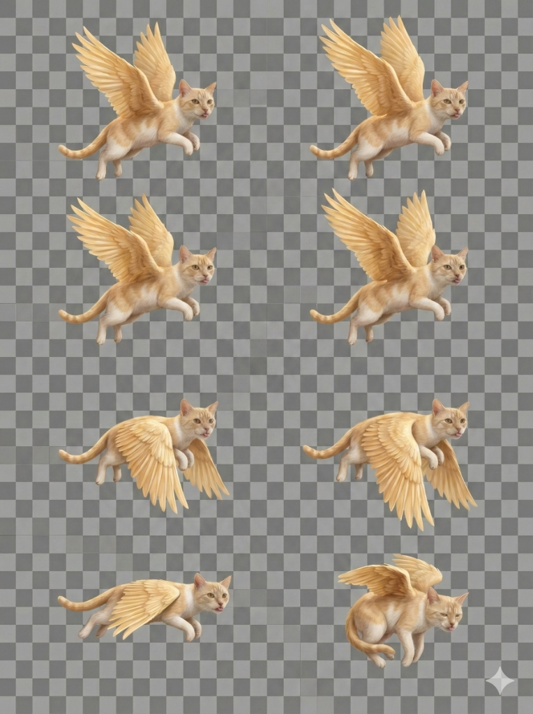

# 🐱✨ Flappy Cat

Kanatlı kediyi kontrol ederek engelleri aşmaya çalıştığın eğlenceli bir oyun!



## 🎮 Nasıl Oynanır?

- **Space** tuşuna bas veya ekrana **tıkla/dokun** kedinin zıplaması için
- Engellerin arasından geçerek puan topla
- Engellere veya yere çarpmadan mümkün olduğunca uzağa git!

## ✨ Özellikler

- 🌟 Premium görsel efektler ve animasyonlar
- 🎵 Prosedürel ses efektleri (harici dosya gerektirmez)
- ⭐ Parçacık sistemleri (tüyler, parıltılar)
- 🏔️ Parallax arka plan
- 📱 Mobil uyumlu (touch kontrol)
- 💾 Yüksek skor kaydı (localStorage)
- 🎯 Artan zorluk sistemi

## 🚀 GitHub Pages'te Yayınlama

### 1. Repository Oluştur

```bash
# Proje klasörüne git
cd flappy-cat

# Git'i başlat
git init

# Tüm dosyaları ekle
git add .

# İlk commit
git commit -m "🎮 Flappy Cat oyunu"
```

### 2. GitHub'a Yükle

1. [GitHub](https://github.com/new) adresinde yeni bir repository oluştur
2. Repository adı: `flappy-cat`
3. Public olarak ayarla
4. README ekleme seçeneğini işaretleme (zaten var)

```bash
# Remote ekle (kendi kullanıcı adınla değiştir)
git remote add origin https://github.com/KULLANICI_ADIN/flappy-cat.git

# Main branch'e push et
git branch -M main
git push -u origin main
```

### 3. GitHub Pages'i Aktifleştir

1. Repository'nin **Settings** sekmesine git
2. Sol menüden **Pages** seçeneğini tıkla
3. **Source** bölümünde:
   - Branch: `main`
   - Folder: `/ (root)`
4. **Save** butonuna tıkla

### 4. Oyunu Paylaş! 🎉

Birkaç dakika içinde oyunun şu adreste yayında olacak:

```
https://KULLANICI_ADIN.github.io/flappy-cat/
```

## 📁 Proje Yapısı

```
flappy-cat/
├── index.html          # Ana HTML
├── css/
│   └── style.css       # Premium stiller
├── js/
│   ├── game.js         # Oyun motoru
│   ├── bird.js         # Kedi karakteri
│   ├── pipes.js        # Engel sistemi
│   ├── particles.js    # Parçacık efektleri
│   └── audio.js        # Ses sistemi
├── assets/
│   └── sprites/
│       └── cat.png     # Kedi sprite sheet
└── README.md           # Bu dosya
```

## 🛠️ Teknolojiler

- Vanilla JavaScript (ES6+)
- HTML5 Canvas API
- Web Audio API
- CSS3 Animations
- LocalStorage API

## 📄 Lisans

Bu proje MIT lisansı ile lisanslanmıştır.

---

Made with 💜 | Flappy Cat 2026
